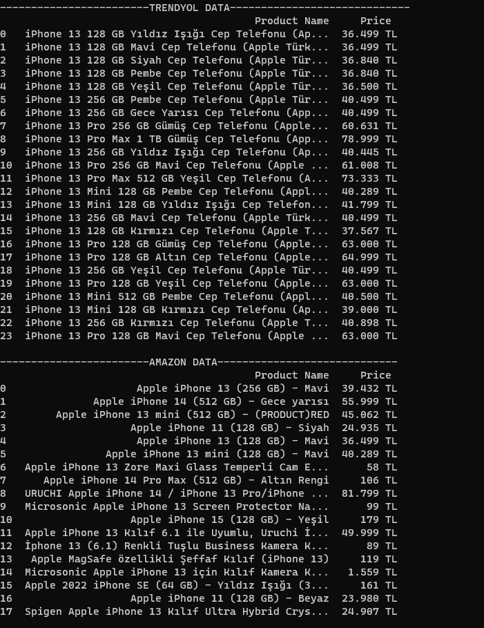

# PriceScraper
This Python script is designed to scrape product prices from two popular e-commerce websites: Amazon and Trendyol. It utilizes the Selenium web automation framework to automate the process of searching for a specified product and extracting the relevant pricing information.

## Why are Amazon Search Results So Peculiar?
I still haven't been able to figure out the reason, but for example, when you search for 'iphone 13,' most of the results are related to phone cases and screen protectors, with very few being actually about the phone itself. Providing a specific brand like 'apple iphone 13' might be helpful for obtaining better results.

## What is xpath_methode.py?
Although this method does not work on most sites, it has proven effective on Trendyol. Although it may not seem like the most logical approach, when you examine the XPaths, you'll notice that products are listed according to a specific pattern. By making these XPaths dynamic, you can access all the products.

If you are using this on a Turkish website, the program will work. However, if you are in a different country, you may need to adjust the "TL" in the if statement on line 29 according to the language of the page. For example, you can replace "TL" with "EURO" or the "$" symbol.

## Example Output
